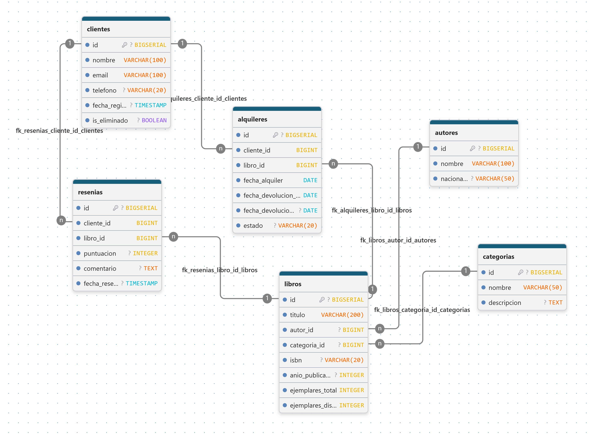

# 📚 **API REST - Gestión y Administración para Librería**

Proyecto backend desarrollado con Java + Spring Boot que permite gestionar clientes, libros, autores, y todo lo referente a una librería mediante una API RESTful con operaciones CRUD: crear, leer, actualizar y eliminar.  

## 🛠 Tecnologías utilizadas

- Java 17+  

-Spring Boot 

-Spring Data JPA   

-MySQL (o H2 en desarrollo)  

-Postman (para pruebas de la API)  

-Maven  

## 📊 Base de Datos

## 🚀 Funcionalidades  

✅ Registrar nuevos clientes  

✅ Obtener todos los clientes o uno por su ID  

✅ Actualizar los datos de un cliente  

✅ Eliminar (o desactivar) un cliente  

✅ Manejo de fechas con LocalDate  

✅ Uso de ResponseEntity para respuestas personalizadas  

✅ Anotaciones como @RestController, @Service, @Repository, @Transactional, etc.  

## 📄 Modelos

-Clientes

-Libros

-Reseñas

-Promociones

## 🔗 Endpoints de la API

| Método | Ruta                 | Descripción                  |
| ------ | -------------------- | ---------------------------- |
| GET    | `/api/clientes`      | Listar todos los clientes    |
| GET    | `/api/clientes/{id}` | Buscar cliente por ID        |
| POST   | `/api/clientes`      | Registrar un nuevo cliente   |
| PUT    | `/api/clientes/{id}` | Actualizar cliente existente |
| DELETE | `/api/clientes/{id}` | Eliminar cliente por ID      |

| Método | Ruta                 | Descripción                  |
| ------ | -------------------- | ---------------------------- |
| GET    | `/api/libros`      | Listar todos los libros    |
| GET    | `/api/libros/{id}` | Buscar libro por ID        |
| POST   | `/api/libros`      | Registrar un nuevo libro   |
| PUT    | `/api/libros/{id}` | Actualizar libro existente |
| DELETE | `/api/libros/{id}` | Eliminar libro por ID      |

| Método | Ruta                 | Descripción                  |
| ------ | -------------------- | ---------------------------- |
| GET    | `/api/resenas`      | Listar todos las reseñas    |
| GET    | `/api/resenas/{id}` | Buscar reseña por ID        |
| POST   | `/api/resenas`      | Registrar un nuevo reseña   |
| PUT    | `/api/resenas/{id}` | Actualizar reseña existente |
| DELETE | `/api/resenas/{id}` | Eliminar reseña por ID      |

| Método | Ruta                 | Descripción                  |
| ------ | -------------------- | ---------------------------- |
| GET    | `/api/resenas`      | Listar todos las reseñas    |
| GET    | `/api/resenas/{id}` | Buscar reseña por ID        |
| POST   | `/api/resenas`      | Registrar un nuevo reseña   |
| PUT    | `/api/resenas/{id}` | Actualizar reseña existente |
| DELETE | `/api/resenas/{id}` | Eliminar reseña por ID      |

## 🧪 Pruebas con Postman  

Envía solicitudes a http://localhost:8080/api/clientes  

Aquí un ejemplo para crear un cliente:  

{  

  "nombre": "Juan Pérez",  
  "email": "juan@example.com",  
  "telefono": "555123456",  
  "direccion": "Av. Libertador 123", 
  "fechaRegistro": "2025-05-08"  
}  
  
## 📄 Documentación

Para ver la documentación completa del Sistema de Gestión Bibliotecaria, haz clic [aquí](public/M1-1%20Sistema_de_GestionBibliotecaria.md).

## 📌 Autor 

Desarrollado por Carlos Enrique Mamani Torrez  

